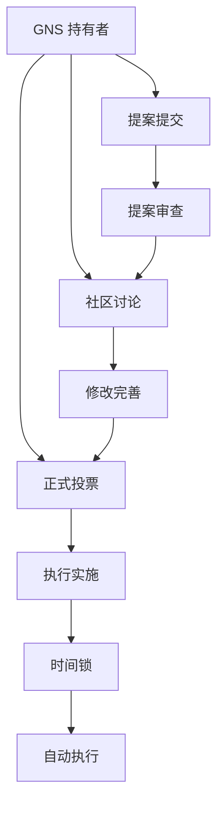

# Gains Network 治理

Gains Network 采用完全去中心化的治理模式，所有重要决策都由 GNS 代币持有者通过民主投票决定。这确保了协议的发展方向真正反映社区的集体意志。

## 🏛️ 治理架构

### 治理层级



### 参与者角色

#### 1. 代币持有者
- **投票权**: 基于持有的 GNS 数量
- **提案权**: 满足最低门槛可提交提案
- **监督权**: 监督提案执行情况

#### 2. 委托代表
- **代理投票**: 代表委托人参与投票
- **专业判断**: 提供专业的决策建议
- **责任制**: 对委托人负责

#### 3. 核心团队
- **技术实施**: 负责提案的技术实现
- **风险评估**: 评估提案的技术风险
- **建议提供**: 提供专业建议但不决策

## 📋 提案类型

### 参数调整提案

#### 交易参数
- **最大杠杆倍数**: 调整各资产的最大杠杆
- **交易费率**: 修改开仓和平仓费率
- **资金费率**: 调整隔夜费计算方式
- **最小头寸**: 设置最小交易金额

#### 风险参数
- **清算阈值**: 调整强制清算的触发条件
- **价格偏差**: 设置价格保护机制
- **最大敞口**: 限制单一资产的总敞口
- **保险基金**: 调整保险基金参数

### 功能升级提案

#### 新功能开发
- **新资产支持**: 添加新的交易对
- **交易功能**: 增加新的交易类型
- **用户界面**: 改进用户体验
- **API 接口**: 扩展开发者工具

#### 性能优化
- **Gas 费优化**: 降低交易成本
- **执行速度**: 提高交易确认速度
- **系统稳定性**: 增强系统可靠性
- **安全性**: 加强安全保护措施

### 经济模型提案

#### 代币经济
- **燃烧机制**: 调整代币燃烧规则
- **质押奖励**: 修改质押收益分配
- **通胀政策**: 调整代币发行政策
- **回购政策**: 制定回购销毁计划

#### 收入分配
- **费用分配**: 调整收入分配比例
- **储备基金**: 管理协议储备资金
- **开发资金**: 分配开发预算
- **营销资金**: 制定推广预算

### 战略决策提案

#### 生态发展
- **合作伙伴**: 选择战略合作伙伴
- **投资决策**: 对外投资和收购
- **市场扩展**: 进入新的市场领域
- **技术路线**: 确定技术发展方向

#### 治理改革
- **投票规则**: 修改治理投票规则
- **提案门槛**: 调整提案提交门槛
- **执行机制**: 改进提案执行流程
- **争议解决**: 建立争议仲裁机制

## 🗳️ 投票机制

### 投票权计算

#### 基础投票权
```javascript
// 基础投票权 = 持有的 GNS 数量
const baseVotingPower = gnsBalance;
```

#### 加权机制
| 持有方式 | 投票权倍数 | 锁定要求 |
|---------|-----------|----------|
| 钱包持有 | 1x | 无 |
| 质押状态 | 1.5x | 无强制锁定 |
| 6个月锁定 | 2x | 6个月不可提取 |
| 1年锁定 | 3x | 1年不可提取 |
| 2年锁定 | 4x | 2年不可提取 |

#### 委托投票
- **委托机制**: 可将投票权委托给他人
- **随时撤回**: 可随时取消委托
- **透明度**: 委托关系公开透明
- **责任制**: 被委托人需定期报告

### 投票流程

#### 1. 提案阶段（7天）
- **提案提交**: 满足门槛的用户提交提案
- **格式要求**: 按照标准格式撰写提案
- **初步审查**: 社区进行初步合规审查
- **公示期**: 提案公开展示供社区查看

#### 2. 讨论阶段（14天）
- **社区讨论**: 在官方论坛进行讨论
- **专家意见**: 邀请专家提供技术意见
- **风险评估**: 评估提案的潜在风险
- **修改完善**: 根据反馈修改提案内容

#### 3. 投票阶段（7天）
- **正式投票**: 开启链上投票
- **实时统计**: 实时显示投票进度
- **最后冲刺**: 投票截止前的最后呼吁
- **结果公布**: 投票结束后立即公布结果

#### 4. 执行阶段（2-7天）
- **时间锁**: 通过的提案进入时间锁
- **技术准备**: 准备技术实施方案
- **社区通知**: 通知社区即将执行的变更
- **正式执行**: 时间锁到期后自动执行

### 投票规则

#### 通过标准
| 提案类型 | 支持率要求 | 参与率要求 | 特殊要求 |
|---------|-----------|-----------|----------|
| 参数调整 | >50% | >10% | 无 |
| 功能升级 | >60% | >15% | 技术审查 |
| 经济模型 | >66% | >20% | 经济影响评估 |
| 战略决策 | >75% | >25% | 风险评估 |

#### 否决权
- **大户否决**: 单一地址持有 >10% 时拥有否决权
- **联合否决**: 前5大持有者联合可行使否决权
- **时间限制**: 否决权需在投票期内行使
- **理由说明**: 行使否决权需公开说明理由

## 🛡️ 安全保障

### 提案安全

#### 恶意提案防护
- **门槛设置**: 高门槛防止垃圾提案
- **社区审查**: 多重审查机制
- **专家评估**: 技术和经济专家评估
- **时间锁**: 给社区充分时间反应

#### 执行安全
- **多重签名**: 关键操作需要多签确认
- **渐进式执行**: 重大变更分阶段实施
- **回滚机制**: 出现问题时的紧急回滚
- **监控系统**: 实时监控执行效果

### 治理攻击防护

#### 闪电贷攻击
- **快照机制**: 投票权基于历史快照
- **持有期要求**: 代币需持有一定时间才有投票权
- **多区块验证**: 跨多个区块验证持有情况
- **异常检测**: 自动检测异常的代币流动

#### 贿选防护
- **匿名投票**: 部分投票采用匿名机制
- **投票验证**: 验证投票的真实性
- **社区监督**: 社区监督投票过程
- **惩罚机制**: 对贿选行为进行惩罚

## 📊 治理统计

### 历史数据

#### 提案统计
::: info 治理活动统计
- **总提案数**: 47 个
- **通过率**: 73%
- **平均参与率**: 18.5%
- **最高参与率**: 32.1%（重大升级提案）
:::

#### 参与度分析
| 时期 | 活跃投票者 | 平均参与率 | 代表性指数 |
|------|-----------|-----------|-----------|
| 2023 Q1 | 2,340 | 15.2% | 0.73 |
| 2023 Q2 | 3,120 | 18.7% | 0.81 |
| 2023 Q3 | 3,890 | 21.3% | 0.85 |
| 2023 Q4 | 4,560 | 19.8% | 0.88 |

### 治理健康度

#### 关键指标
- **去中心化程度**: 前10大持有者占比 < 40%
- **参与多样性**: 活跃投票者地理分布广泛
- **决策质量**: 通过提案的成功实施率 > 90%
- **社区满意度**: 基于调查的社区满意度 > 8.0/10

#### 改进空间
- **参与率提升**: 目标参与率 > 25%
- **新人友好**: 改善新用户的参与体验
- **教育推广**: 加强治理教育和培训
- **工具优化**: 优化投票界面和工具

## 🎯 参与指南

### 新手参与

#### 第一步：了解基础
1. **阅读文档**: 充分了解协议机制
2. **获得代币**: 购买或赚取 GNS 代币
3. **关注社区**: 加入官方讨论群组
4. **学习治理**: 了解治理流程和规则

#### 第二步：开始参与
1. **观察讨论**: 先观察社区讨论
2. **小额投票**: 从小额代币开始投票
3. **提出问题**: 在讨论中提出疑问
4. **表达观点**: 理性表达自己的观点

#### 第三步：深度参与
1. **委托或被委托**: 参与委托投票机制
2. **提交提案**: 提交自己的改进提案
3. **成为专家**: 在某个领域成为专家
4. **领导讨论**: 主动引导社区讨论

### 高级参与

#### 成为提案人
- **专业知识**: 具备相关专业知识
- **社区声誉**: 在社区中建立良好声誉
- **资源投入**: 投入时间和精力撰写提案
- **执行能力**: 具备推动提案执行的能力

#### 成为委托代表
- **公开承诺**: 公开自己的治理理念
- **定期报告**: 定期向委托人报告决策
- **专业判断**: 基于专业知识做出判断
- **责任担当**: 对决策结果负责

## 🔮 治理发展

### 短期目标（2024）

#### 参与度提升
- **工具优化**: 推出更好用的投票工具
- **教育计划**: 启动治理教育计划
- **激励机制**: 设计参与激励机制
- **多语言支持**: 支持多语言治理

#### 流程优化
- **快速通道**: 为紧急提案设立快速通道
- **专业委员会**: 成立技术和经济委员会
- **争议仲裁**: 建立争议仲裁机制
- **透明度提升**: 增强决策过程透明度

### 长期愿景（2025-2026）

#### 治理创新
- **AI 辅助**: 利用 AI 辅助治理决策
- **预测市场**: 引入预测市场机制
- **动态参数**: 实现参数的自动调整
- **跨链治理**: 实现多链统一治理

#### 生态治理
- **联盟治理**: 与其他协议建立治理联盟
- **标准制定**: 参与 DeFi 治理标准制定
- **最佳实践**: 成为去中心化治理的典范
- **社会影响**: 扩大治理的社会影响力

---

*Gains Network 的治理是一个持续进化的过程，我们相信通过社区的集体智慧，能够构建一个更加公平、高效、可持续的协议。*
