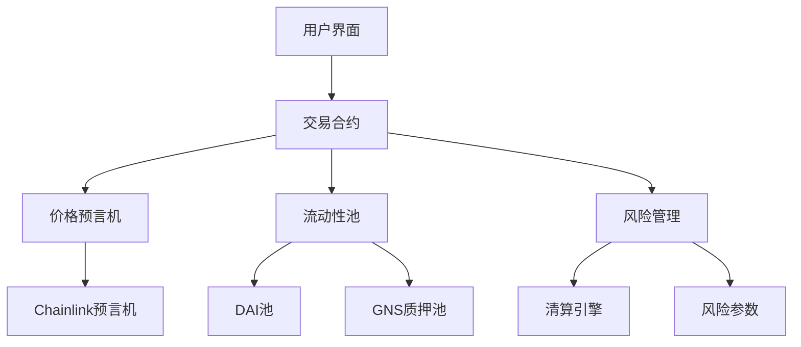

# Gains Network 概述

Gains Network 是一个革命性的去中心化交易协议，通过创新的技术架构为用户提供高效、安全的杠杆交易体验。本文将深入介绍协议的技术特点、架构设计和生态组成。

## 🏗️ 技术架构

### 核心协议设计

Gains Network 采用模块化架构，由多个相互协作的智能合约组成：



### 智能合约体系

| 合约类型 | 功能 | 描述 |
|---------|------|------|
| Trading | 交易执行 | 处理开仓、平仓、止损等交易操作 |
| Vault | 资金管理 | 管理DAI流动性池和资金分配 |
| Callbacks | 价格回调 | 处理预言机价格更新和交易确认 |
| Staking | 质押奖励 | 管理GNS质押和奖励分发 |
| Governance | 治理投票 | 处理协议参数修改和升级投票 |

### 价格预言机系统

#### 多层价格验证

1. **主要数据源**：Chainlink 去中心化预言机网络
2. **备用数据源**：多个独立的价格提供商
3. **价格聚合**：加权平均算法确保价格准确性
4. **异常检测**：自动识别和过滤异常价格数据

#### 价格更新机制

- **实时更新**：价格每 2-5 秒更新一次
- **价格偏差保护**：防止价格操纵和闪电贷攻击
- **延迟保护**：处理网络延迟和价格滞后问题

## 💎 流动性基础设施

### DAI 稳定币池

DAI 池是协议的核心流动性来源：

#### 功能特性
- **对手方角色**：为所有交易提供对手方流动性
- **动态管理**：根据市场情况自动调整参数
- **风险分散**：通过多样化的交易对冲风险

#### 收益来源
```
池收益 = 交易手续费 + 隔夜费 + 清算费 - 交易者盈利
```

#### 风险管理
- **敞口限制**：每个资产的最大敞口限制
- **动态参数**：根据风险自动调整杠杆和费用
- **保险机制**：多层保险保护资金安全

### GNS 质押系统

#### 质押机制
- **单币质押**：只需质押 GNS 代币
- **灵活期限**：支持不同的锁定期限
- **自动复投**：奖励自动重新质押

#### 奖励分配
- **交易费分润**：获得交易手续费的一定比例
- **治理奖励**：参与治理活动获得额外奖励
- **通胀奖励**：新发行代币的分配

## 🔧 交易引擎

### 订单执行流程

1. **订单提交**：用户在前端提交交易订单
2. **参数验证**：智能合约验证订单参数合法性
3. **价格获取**：从预言机获取最新价格
4. **风险检查**：检查账户余额和风险限制
5. **交易执行**：执行交易并更新账户状态
6. **事件记录**：在区块链上记录交易事件

### 零滑点机制

传统 AMM 的问题：
- 大额交易面临高滑点
- 流动性不足导致价格冲击
- MEV（最大可提取价值）攻击风险

Gains Network 的解决方案：
- **预言机定价**：所有交易按预言机价格执行
- **无限流动性**：理论上支持无限大的交易量
- **公平执行**：先到先得，没有抢跑空间

### 风险控制系统

#### 实时风险监控
```javascript
// 风险检查示例
function checkRisk(trade) {
  return {
    marginRatio: calculateMarginRatio(trade),
    exposure: calculateExposure(trade.asset),
    maxLeverage: getMaxLeverage(trade.asset),
    liquidationPrice: calculateLiquidationPrice(trade)
  }
}
```

#### 动态参数调整
- **最大杠杆**：根据市场波动性动态调整
- **敞口限制**：防止单一资产过度集中
- **费用调节**：通过费用激励平衡多空比例

## 🌐 多链架构

### 当前支持的网络

#### Arbitrum One
- **主要部署网络**
- **优势**：低费用、快速确认、以太坊安全性
- **TPS**：~40,000 TPS
- **平均费用**：$0.1-1

#### Polygon
- **备选网络**
- **优势**：极低费用、高吞吐量
- **TPS**：~7,000 TPS
- **平均费用**：$0.01-0.1

### 跨链桥接

#### 官方桥接服务
- **Arbitrum Bridge**：连接以太坊主网和 Arbitrum
- **Polygon Bridge**：连接以太坊主网和 Polygon
- **多签验证**：多重签名确保桥接安全

#### 第三方桥接
- **Hop Protocol**：快速跨链转账
- **Connext**：去中心化跨链桥
- **Multichain**：多链资产桥接

## 📊 数据分析

### 链上数据追踪

#### 核心指标
- **日交易量**：每日总交易金额
- **活跃用户**：唯一地址数量
- **流动性规模**：DAI 池总价值
- **平均杠杆**：用户平均杠杆倍数

#### 风险指标
- **多空比例**：市场情绪指标
- **清算率**：风险管理效果
- **资金利用率**：流动性使用效率
- **收益分布**：交易者盈亏分析

### API 接口

#### RESTful API
```
GET /api/v1/stats/trading-volume
GET /api/v1/pairs/list
GET /api/v1/user/{address}/positions
POST /api/v1/orders/create
```

#### WebSocket 订阅
```javascript
// 实时价格订阅
ws.subscribe('prices', ['BTC/USD', 'ETH/USD'])

// 交易事件订阅
ws.subscribe('trades', {address: userAddress})
```

## 🔐 安全保障

### 智能合约安全

#### 审计历史
- **Certik**：全面安全审计（2023年3月）
- **PeckShield**：代码审查（2023年1月）
- **Consensys Diligence**：架构评估（2022年11月）

#### 安全措施
- **时间锁**：重要参数修改有48小时延迟
- **多签钱包**：关键操作需要多重签名
- **漏洞赏金**：提供高额赏金发现安全问题
- **形式化验证**：数学证明关键算法的正确性

### 运营安全

#### 监控系统
- **24/7 监控**：全天候系统状态监控
- **异常告警**：实时异常检测和通知
- **应急响应**：快速响应安全事件

#### 备份机制
- **数据备份**：重要数据多地备份
- **服务冗余**：多个服务节点确保可用性
- **灾难恢复**：完整的灾难恢复计划

## 🚀 性能优化

### 交易速度优化

#### 前端优化
- **WebSocket 连接**：实时数据推送
- **本地缓存**：减少网络请求
- **预加载机制**：提前加载常用数据

#### 后端优化
- **批量处理**：批量执行相关操作
- **索引优化**：数据库查询优化
- **CDN 加速**：全球内容分发网络

### 成本优化

#### Gas 费优化
- **批量交易**：将多个操作打包执行
- **智能路由**：选择最优的执行路径
- **Layer 2 优先**：优先使用低成本网络

## 📈 生态系统

### 核心组件

#### gTrade 平台
- **Web 应用**：浏览器端交易界面
- **移动端**：响应式设计支持移动设备
- **API 接口**：开发者集成接口

#### 流动性挖矿
- **LP 奖励**：为 DAI 池提供流动性获得奖励
- **交易奖励**：活跃交易获得代币奖励
- **推荐奖励**：邀请用户获得分成

### 合作伙伴

#### 技术合作
- **Chainlink**：价格预言机服务
- **OpenZeppelin**：智能合约安全库
- **The Graph**：去中心化数据索引

#### 生态合作
- **钱包集成**：主流钱包直接支持
- **DeFi 协议**：与其他 DeFi 协议深度集成
- **交易工具**：第三方交易工具和分析平台

## 🔮 未来发展

### 技术路线图

#### 2024 年目标
- **更多资产**：扩展到更多交易对
- **跨链扩展**：支持更多区块链网络
- **性能提升**：进一步优化交易速度和成本

#### 长期愿景
- **全链部署**：在所有主流链上部署
- **机构级产品**：面向机构客户的专业工具
- **AI 集成**：人工智能驱动的交易优化

### 社区发展

#### 开发者计划
- **开源代码**：逐步开源核心代码
- **开发者资助**：资助生态系统开发
- **技术文档**：完善的开发者文档

#### 教育推广
- **用户教育**：交易教程和最佳实践
- **社区建设**：活跃的社区讨论和支持
- **伙伴关系**：与教育机构和 KOL 合作

---

*Gains Network 不仅仅是一个交易协议，更是下一代 DeFi 基础设施的重要组成部分。*
