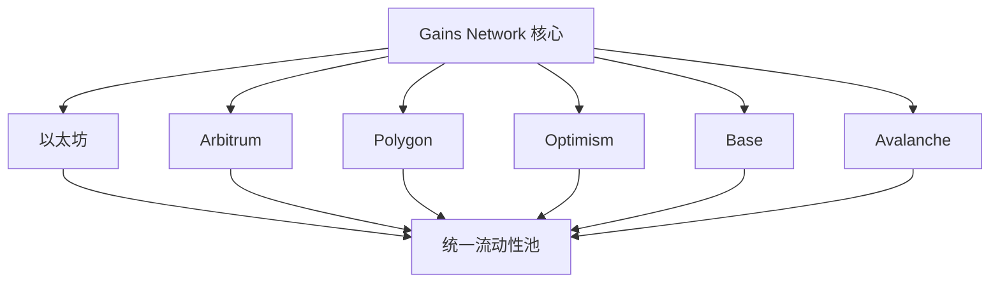

# Gains Network 路线图

Gains Network 致力于成为去中心化金融领域最创新、最可靠的杠杆交易协议。我们的路线图反映了团队和社区的共同愿景，旨在构建一个更加开放、高效、用户友好的交易生态系统。

## 🎯 总体愿景

### 使命宣言
构建下一代去中心化交易基础设施，让全球任何人都能公平、安全、高效地参与金融市场交易。

### 核心价值观
- **去中心化**: 真正的去中心化治理和运营
- **创新**: 持续的技术创新和产品优化
- **包容性**: 为所有用户提供平等的机会
- **透明度**: 完全透明的协议运营
- **可持续性**: 长期可持续的发展模式

## 🗓️ 发展时间线

### 2024年第一季度 ✅

#### 核心功能完善
- [x] **零滑点交易引擎**: 完成核心交易引擎优化
- [x] **多资产支持**: 支持 150+ 交易对
- [x] **风险管理系统**: 完善的风险控制机制
- [x] **用户界面 V2**: 全新的用户界面设计

#### 安全审计
- [x] **Certik 审计**: 完成 Certik 全面安全审计
- [x] **PeckShield 审计**: 完成 PeckShield 代码审查
- [x] **漏洞赏金**: 启动漏洞赏金计划
- [x] **保险合作**: 与 DeFi 保险协议合作

### 2024年第二季度 ✅

#### 跨链扩展
- [x] **Arbitrum 部署**: 在 Arbitrum 网络部署协议
- [x] **Polygon 集成**: 完成 Polygon 网络集成
- [x] **跨链桥**: 实现资产跨链桥接
- [x] **统一流动性**: 跨链流动性统一管理

#### 生态建设
- [x] **合作伙伴计划**: 启动生态合作伙伴计划
- [x] **开发者工具**: 发布 API 和 SDK
- [x] **社区治理**: 完善去中心化治理机制
- [x] **代币经济优化**: 优化代币经济模型

### 2024年第三季度 🚧

#### 产品创新
- [ ] **永续期权**: 推出永续期权交易
- [ ] **结构化产品**: 开发结构化金融产品
- [ ] **自动化策略**: 支持自动化交易策略
- [ ] **社交交易**: 实现跟单交易功能

#### 用户体验
- [ ] **移动端优化**: 优化移动端交易体验
- [ ] **一键交易**: 简化交易操作流程
- [ ] **智能推荐**: AI 驱动的交易建议
- [ ] **教育系统**: 内置交易教育系统

### 2024年第四季度 📋

#### 机构级功能
- [ ] **API 交易**: 专业级 API 交易接口
- [ ] **批量操作**: 支持批量交易操作
- [ ] **高级订单**: 更多高级订单类型
- [ ] **风险报告**: 详细的风险分析报告

#### 合规建设
- [ ] **KYC 集成**: 可选的身份验证系统
- [ ] **报税工具**: 交易记录和税务工具
- [ ] **监管对接**: 与监管机构建立沟通
- [ ] **合规框架**: 建立合规操作框架

## 🚀 2025年发展规划

### 第一季度：全球化扩展

#### 多链生态

#### 目标网络
- **Optimism**: 优化 Layer 2 体验
- **Base**: 接入 Coinbase 生态
- **Avalanche**: 扩展雪崩生态
- **BSC**: 进入币安生态
- **Solana**: 探索 Solana 部署

#### 国际化
- **多语言支持**: 支持 20+ 种语言
- **本地化运营**: 在主要市场建立本地团队
- **文化适应**: 适应不同地区的交易习惯
- **监管适应**: 适应各地监管要求

### 第二季度：技术创新

#### 核心技术升级
- **零知识证明**: 集成 ZK 技术提升隐私
- **Layer 3 探索**: 探索应用专用区块链
- **MEV 保护**: 更强的 MEV 保护机制
- **原子化交易**: 支持原子化复合交易

#### AI 集成
- **智能路由**: AI 优化的交易路由
- **风险预警**: AI 驱动的风险预警系统
- **市场分析**: 智能市场分析工具
- **个性化推荐**: 基于 AI 的个性化服务

### 第三季度：生态建设

#### DeFi 集成
- **收益聚合**: 集成收益聚合功能
- **借贷协议**: 与借贷协议深度集成
- **流动性质押**: 支持流动性质押代币
- **跨协议组合**: 实现跨协议策略组合

#### 现实世界资产（RWA）
- **股票交易**: 支持代币化股票交易
- **商品期货**: 添加更多商品期货
- **房地产**: 探索房地产代币化
- **债券市场**: 支持政府和企业债券

### 第四季度：机构服务

#### 机构产品
- **Prime Brokerage**: 机构级主经纪商服务
- **大宗交易**: 支持大额场外交易
- **定制化服务**: 为机构客户定制服务
- **托管集成**: 与机构托管服务集成

#### 企业解决方案
- **白标解决方案**: 为其他项目提供白标服务
- **API 服务**: 企业级 API 服务
- **SaaS 平台**: 软件即服务平台
- **咨询服务**: 为其他项目提供技术咨询

## 🌟 2026年长期愿景

### 成为 DeFi 基础设施

#### 协议级集成
- **标准制定**: 参与制定行业标准
- **开源贡献**: 为 DeFi 生态贡献开源代码
- **研究发布**: 发布前沿研究成果
- **教育推广**: 推广 DeFi 教育和认知

#### 生态系统领导者
- **技术创新**: 引领 DeFi 技术创新方向
- **最佳实践**: 建立行业最佳实践
- **标杆产品**: 成为同类产品的标杆
- **思想领袖**: 在 DeFi 领域发挥思想领导作用

### 全球金融基础设施

#### 传统金融桥梁
- **TradFi 集成**: 与传统金融系统集成
- **监管合作**: 与全球监管机构合作
- **机构采用**: 推动机构大规模采用
- **标准化**: 推动 DeFi 标准化进程

#### 社会影响
- **金融包容**: 推动全球金融包容性
- **经济民主化**: 促进金融服务民主化
- **创新推动**: 推动金融科技创新
- **可持续发展**: 促进可持续金融发展

## 🔬 研发重点

### 技术研发

#### 核心技术
- **共识机制**: 探索新的共识机制
- **扩容方案**: 研发更好的扩容解决方案
- **隐私保护**: 增强用户隐私保护
- **互操作性**: 提升跨链互操作性

#### 前沿探索
- **量子计算**: 研究量子计算对加密的影响
- **Web3 集成**: 与 Web3 生态深度集成
- **元宇宙**: 探索元宇宙中的金融应用
- **碳中和**: 研发碳中和的区块链解决方案

### 产品研发

#### 用户体验
- **无 Gas 交易**: 实现用户无感的 Gas 费
- **一键操作**: 极简的用户操作体验
- **语音交易**: 支持语音交易指令
- **AR/VR 界面**: 探索 AR/VR 交易界面

#### 智能化
- **自动化交易**: 全自动化交易系统
- **智能合约**: 更智能的合约逻辑
- **预测分析**: 基于 AI 的市场预测
- **风险管理**: 智能化风险管理系统

## 📊 成功指标

### 短期目标（2024年底）

#### 用户指标
- **日活用户**: 50,000+ DAU
- **月活用户**: 200,000+ MAU
- **用户留存**: 60%+ 月留存率
- **用户满意度**: 4.5+ 星评分

#### 交易指标
- **日交易量**: $100M+ 日均交易量
- **总价值锁定**: $500M+ TVL
- **交易成功率**: 99.9%+ 交易成功率
- **平均滑点**: <0.01% 平均滑点

### 中期目标（2025年底）

#### 市场指标
- **市场份额**: DeFi 杠杆交易市场 20%+ 份额
- **网络数量**: 部署在 10+ 个区块链网络
- **合作伙伴**: 100+ 生态合作伙伴
- **地区覆盖**: 覆盖全球 50+ 个国家和地区

#### 生态指标
- **开发者数量**: 1,000+ 活跃开发者
- **项目集成**: 500+ 项目集成我们的协议
- **社区规模**: 1,000,000+ 社区成员
- **治理参与**: 30%+ 治理参与率

### 长期目标（2026年底）

#### 影响力指标
- **行业地位**: 成为 DeFi 交易领域的领导者
- **技术创新**: 推出 5+ 重大技术创新
- **标准制定**: 参与制定 3+ 行业标准
- **学术贡献**: 发表 20+ 高质量研究论文

#### 可持续性指标
- **协议收入**: $100M+ 年度协议收入
- **碳中和**: 实现碳中和运营
- **社会责任**: 推动 10+ 社会责任项目
- **教育普及**: 培训 100,000+ DeFi 用户

## 🤝 社区参与

### 社区驱动发展

#### 开放协作
- **公开路线图**: 路线图完全公开透明
- **社区反馈**: 积极收集和响应社区反馈
- **开源贡献**: 鼓励社区开源贡献
- **共同决策**: 重大决策由社区投票决定

#### 贡献奖励
- **贡献者计划**: 为贡献者提供丰厚奖励
- **漏洞赏金**: 持续的漏洞赏金计划
- **创新竞赛**: 定期举办创新竞赛
- **教育奖励**: 为教育推广者提供奖励

### 参与方式

#### 技术贡献
- **代码贡献**: 为开源项目贡献代码
- **文档撰写**: 帮助改进技术文档
- **测试反馈**: 参与新功能测试
- **安全审计**: 参与安全审计工作

#### 社区建设
- **内容创作**: 创作高质量的教育内容
- **社区管理**: 参与社区管理工作
- **推广宣传**: 帮助推广 Gains Network
- **用户支持**: 为新用户提供帮助

---

*这份路线图是一个活的文档，会根据技术发展、市场变化和社区反馈持续更新。我们相信，通过社区的集体努力，Gains Network 将成为去中心化金融的重要基础设施。*
