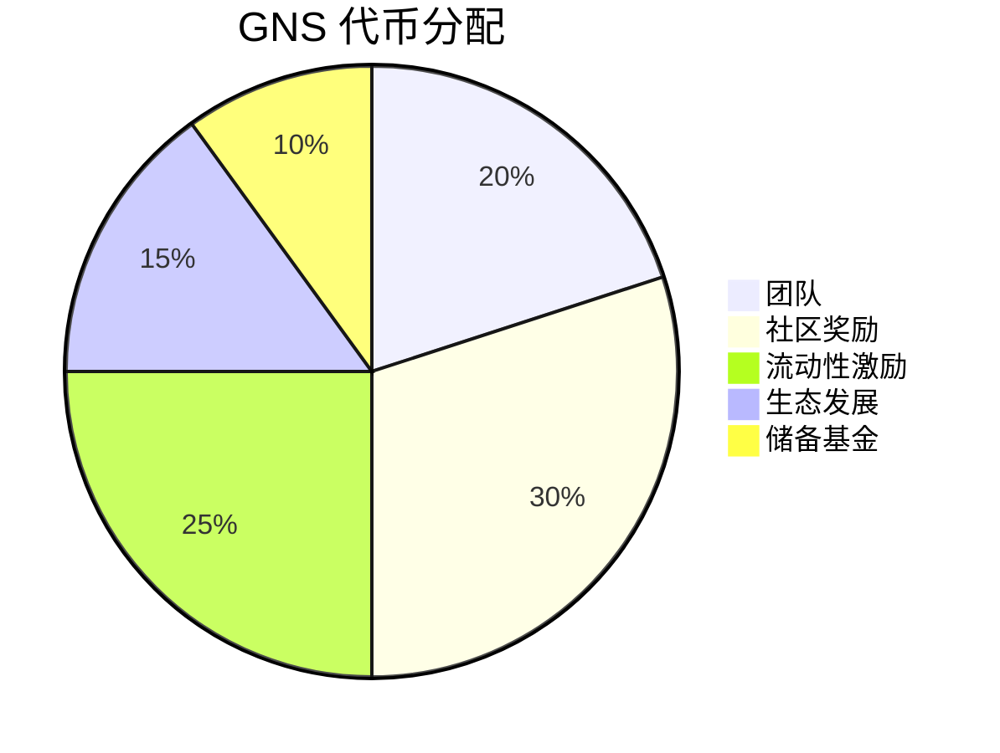
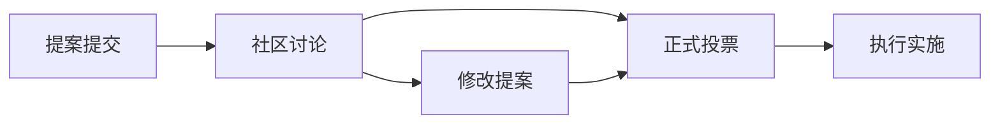

# GNS 代币经济学

GNS 是 Gains Network 生态系统的原生代币，作为整个协议的价值捕获和治理核心。通过精心设计的代币经济模型，GNS 为持有者提供多重价值和激励机制。

## 🪙 代币基本信息

### 代币详情
- **代币名称**: Gains Network Token
- **代币符号**: GNS
- **代币类型**: ERC-20
- **总供应量**: 100,000,000 GNS
- **小数位数**: 18

### 合约地址
- **以太坊主网**: `0x8c91d575074b0e15d94eff2d8d9a6d67b5c1deb4`
- **Arbitrum**: `0x18c11fd286c5ec11c3b683caa813b77f5163a122`
- **Polygon**: `0xe5417af564e4bfda1c483642db72007aa0b86c82`

## 💰 代币分配

### 初始分配结构



| 分配类别 | 数量 | 百分比 | 解锁机制 |
|---------|------|--------|----------|
| 团队 | 20M GNS | 20% | 4年线性解锁 |
| 社区奖励 | 30M GNS | 30% | 根据使用情况分发 |
| 流动性激励 | 25M GNS | 25% | 流动性挖矿奖励 |
| 生态发展 | 15M GNS | 15% | 合作伙伴和集成 |
| 储备基金 | 10M GNS | 10% | 应急储备 |

## 🔥 代币燃烧机制

### 燃烧来源

GNS 具有通缩特性，通过多种机制定期燃烧代币：

#### 1. 交易费燃烧
- **燃烧比例**: 交易费的 10%
- **频率**: 每日自动执行
- **透明度**: 所有燃烧记录公开可查

#### 2. DAI 池盈利燃烧
- **燃烧比例**: DAI 池净盈利的 40%
- **条件**: 仅在池盈利时执行
- **目的**: 减少代币供应，增加稀缺性

#### 3. 治理投票燃烧
- **燃烧比例**: 参与治理的 GNS 可选择燃烧
- **激励**: 燃烧代币获得额外投票权重
- **社区驱动**: 完全由社区决定

### 历史燃烧数据

::: info 燃烧统计
- **累计燃烧**: 5,230,000 GNS
- **当前流通**: 94,770,000 GNS
- **燃烧率**: 年化 3-5%
- **最大单次燃烧**: 500,000 GNS
:::

## 💎 质押机制

### 单币质押

GNS 持有者可以质押代币获得多重收益：

#### 质押奖励构成
1. **交易费分润**: 占质押奖励的 60%
2. **DAI 池收益**: 占质押奖励的 30%
3. **额外 GNS 奖励**: 占质押奖励的 10%

#### 质押参数
- **最小质押**: 1 GNS
- **锁定期**: 无强制锁定
- **提取延迟**: 7天冷却期
- **奖励频率**: 每日分发

### 质押收益计算

```javascript
// 质押收益公式
function calculateStakingRewards(stakedAmount, totalStaked, dailyFees) {
  const userShare = stakedAmount / totalStaked;
  const dailyReward = dailyFees * 0.6 * userShare;
  return dailyReward;
}

// 示例计算
const myStake = 10000; // GNS
const totalStaked = 50000000; // GNS
const dailyFees = 50000; // USD

const myDailyReward = calculateStakingRewards(myStake, totalStaked, dailyFees);
// 结果: 约 $6 每日
```

### APY 预期

| 质押规模 | 预期 APY | 风险等级 |
|---------|----------|----------|
| < 1M GNS | 15-25% | 低 |
| 1M-10M GNS | 10-20% | 中 |
| > 10M GNS | 8-15% | 中低 |

## 🏛️ 治理权益

### 投票权重

GNS 持有者享有协议治理权：

- **基础投票权**: 1 GNS = 1 投票权
- **质押加成**: 质押 GNS 获得 1.5x 投票权
- **长期锁定**: 锁定 1 年获得 2x 投票权
- **燃烧奖励**: 燃烧代币获得 3x 投票权

### 治理提案类型

#### 协议参数调整
- 最大杠杆倍数
- 交易费率
- 资金费率
- 清算阈值

#### 重大决策
- 新资产上线
- 跨链部署
- 合作伙伴关系
- 代币经济调整

#### 财务决策
- 储备基金使用
- 开发资金分配
- 市场推广预算
- 团队激励方案

### 提案流程



1. **提案门槛**: 100,000 GNS 或 1000 个支持者
2. **讨论期**: 7 天社区讨论
3. **投票期**: 5 天正式投票
4. **通过标准**: 超过 50% 支持且参与率 > 10%
5. **执行延迟**: 48 小时时间锁

## 📊 价值捕获机制

### 直接价值捕获

#### 1. 现金流分配
- **质押奖励**: 直接分配交易费收入
- **回购燃烧**: 用收入回购并销毁代币
- **股息分发**: 定期分发协议盈利

#### 2. 稀缺性增加
- **燃烧机制**: 持续减少代币供应
- **质押锁定**: 减少流通代币数量
- **长期激励**: 鼓励长期持有

### 间接价值驱动

#### 1. 网络效应
- **用户增长**: 更多用户带来更多费用
- **交易量增长**: 提高协议收入
- **生态扩张**: 增加代币使用场景

#### 2. 竞争优势
- **技术领先**: 零滑点交易优势
- **社区治理**: 去中心化决策优势
- **先发优势**: 市场领导地位

## 📈 代币指标

### 关键指标追踪

#### 财务指标
- **P/E 比率**: 价格/年化收益比
- **P/S 比率**: 价格/年化收入比
- **流通市值**: 流通代币 × 当前价格
- **完全稀释市值**: 总供应量 × 当前价格

#### 使用指标
- **质押比率**: 质押代币/流通代币
- **治理参与率**: 投票参与的代币比例
- **燃烧率**: 年化燃烧代币比例
- **收益率**: 质押年化收益率

### 价格支撑因素

#### 基本面支撑
1. **收入增长**: 交易量和费用收入增长
2. **用户增长**: 活跃用户数量增长
3. **市场份额**: 在 DeFi 交易市场的份额
4. **竞争优势**: 技术和产品优势

#### 代币经济支撑
1. **燃烧机制**: 持续减少供应
2. **质押奖励**: 提供持有激励
3. **治理价值**: 协议控制权价值
4. **流动性挖矿**: 使用激励

## 🔮 未来发展

### 短期计划（2024）

#### 代币功能扩展
- **支付功能**: 使用 GNS 支付交易费获得折扣
- **保险功能**: 质押 GNS 提供交易保险
- **VIP 功能**: 持有 GNS 享受高级功能

#### 跨链扩展
- **多链部署**: 在更多链上部署 GNS
- **跨链桥接**: 实现 GNS 跨链流动
- **统一治理**: 多链统一治理机制

### 长期愿景（2025-2026）

#### 生态扩张
- **DeFi 集成**: 与更多 DeFi 协议集成
- **CeFi 合作**: 与中心化交易所合作
- **机构采用**: 吸引机构投资者参与

#### 价值升级
- **现实世界资产**: 支持 RWA 交易
- **衍生品生态**: 构建完整衍生品生态
- **全球化运营**: 成为全球 DeFi 基础设施

## 📋 风险提示

### 代币风险

#### 市场风险
- **价格波动**: 代币价格可能大幅波动
- **流动性风险**: 可能出现流动性不足
- **监管风险**: 监管政策变化影响

#### 技术风险
- **智能合约风险**: 合约可能存在漏洞
- **预言机风险**: 价格预言机可能失效
- **网络风险**: 底层区块链网络风险

### 投资建议

::: warning 重要提醒
- GNS 代币投资具有高风险，请谨慎投资
- 请充分了解代币机制再做投资决策  
- 不要投入超过您承受能力的资金
- 建议咨询专业投资顾问意见
:::

---

*GNS 代币经济学设计旨在实现协议价值与代币价值的长期对齐，为持有者创造可持续的价值回报。*
