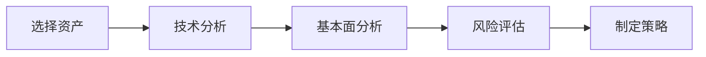
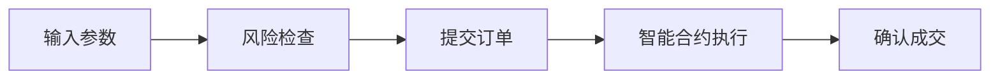
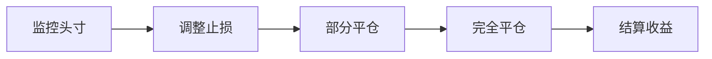

# gTrade 交易平台概述

gTrade 是 Gains Network 的旗舰产品，一个革命性的去中心化杠杆交易平台。通过创新的技术架构，gTrade 为用户提供了传统金融级别的交易体验，同时保持了 DeFi 的开放性和透明度。

## 🎯 平台特色

### 无与伦比的杠杆能力

gTrade 提供市场上最高的杠杆倍数：

| 资产类别 | 最大杠杆 | 示例 |
|---------|----------|------|
| 主流加密货币 | 150x | BTC/USD, ETH/USD |
| 山寨币 | 75x | SOL/USD, AVAX/USD |
| 外汇 | 1000x | EUR/USD, GBP/USD |
| 商品 | 200x | XAU/USD, XTI/USD |
| 股票指数 | 50x | SPX/USD, NDX/USD |

### 零滑点交易

传统 DEX 的痛点：
- ❌ 大额交易面临高滑点
- ❌ 流动性不足影响执行
- ❌ 价格冲击导致损失

gTrade 的创新解决方案：
- ✅ 所有交易零滑点执行
- ✅ 基于预言机的公平定价
- ✅ 无限流动性支持

### 丰富的资产选择

#### 加密货币（50+ 交易对）
```
主流币种：BTC, ETH, BNB, ADA, SOL, AVAX, MATIC
DeFi 代币：UNI, AAVE, COMP, SUSHI, CRV
热门 Meme：DOGE, SHIB, PEPE, FLOKI
```

#### 传统金融资产（100+ 交易对）
```
外汇：EUR/USD, GBP/USD, USD/JPY, AUD/USD
商品：XAU/USD (黄金), XAG/USD (白银), XTI/USD (原油)
指数：SPX/USD (标普500), NDX/USD (纳斯达克)
```

## 🚀 交易功能

### 订单类型

#### 市价单 (Market Orders)
- **即时执行**：按当前市价立即成交
- **适用场景**：快速进出场，抓住市场机会
- **执行速度**：通常在 2-5 秒内确认

#### 限价单 (Limit Orders)
- **价格控制**：设定期望的成交价格
- **自动执行**：价格到达时自动触发
- **适用场景**：在特定价位建仓或平仓

#### 止损单 (Stop Loss Orders)
- **风险控制**：预设最大可接受损失
- **自动保护**：价格触及止损位自动平仓
- **智能执行**：避免滑点影响

#### 止盈单 (Take Profit Orders)
- **利润锁定**：预设盈利目标
- **自动平仓**：达到目标价位自动获利了结
- **阶梯止盈**：支持多层止盈策略

### 高级交易功能

#### 部分平仓
```javascript
// 示例：部分平仓 50% 头寸
closePosition({
  positionId: "12345",
  percentage: 50,
  price: "market" // 或指定价格
})
```

#### 动态止损
- **跟踪止损**：随价格有利变动自动调整止损
- **百分比止损**：基于当前价格设置止损距离
- **价格止损**：固定价格的止损订单

#### 头寸管理
- **实时盈亏**：动态显示未实现盈亏
- **保证金监控**：实时保证金比率提醒
- **风险提示**：接近清算时的预警系统

## 💰 费用结构

### 交易费用

#### 开仓费用
```
开仓费 = 头寸名义价值 × 0.08%

示例：
- 头寸价值：$10,000
- 开仓费：$10,000 × 0.08% = $8
```

#### 平仓费用
```
平仓费 = 头寸名义价值 × 0.08%
```

#### 隔夜费用 (Funding Fee)
隔夜费用每小时计算一次：

| 资产类型 | 年化费率 | 小时费率 |
|---------|----------|----------|
| 加密货币 | 3.65% | 0.00417% |
| 外汇 | 2.92% | 0.00333% |
| 商品 | 4.38% | 0.005% |
| 股票指数 | 3.65% | 0.00417% |

### 费用优化建议

#### 短期交易
- 关注开平仓费用
- 避免频繁开平仓
- 选择低费率时段

#### 长期持仓
- 重点关注隔夜费用
- 计算累计成本
- 考虑费用对收益的影响

## 📊 交易界面

### 主要功能区域

#### 1. 市场选择器
```
功能：
- 资产搜索和筛选
- 分类浏览（加密/外汇/商品等）
- 收藏夹管理
- 热门资产推荐
```

#### 2. 价格图表
```
功能：
- 实时价格展示
- 多时间周期切换
- 技术指标叠加
- 画线工具
```

#### 3. 交易面板
```
功能：
- 买入/卖出切换
- 杠杆选择滑块
- 头寸大小输入
- 止损/止盈设置
```

#### 4. 头寸管理
```
功能：
- 当前持仓列表
- 未实现盈亏显示
- 快速平仓按钮
- 订单修改选项
```

### 用户体验优化

#### 响应式设计
- **桌面端**：完整功能体验
- **平板端**：优化的触控界面
- **手机端**：简化但完整的功能

#### 个性化设置
- **主题选择**：深色/浅色模式
- **布局自定义**：可调整的界面布局
- **快捷键**：键盘快捷操作
- **声音提醒**：交易执行和价格提醒

## 🔄 交易流程

### 完整交易周期

#### 1. 市场分析


#### 2. 订单执行


#### 3. 头寸管理


### 交易确认流程

1. **参数验证**
   - 检查账户余额
   - 验证订单参数
   - 确认风险限制

2. **价格获取**
   - 从 Chainlink 获取最新价格
   - 计算执行价格
   - 验证价格时效性

3. **风险检查**
   - 计算保证金需求
   - 检查最大杠杆限制
   - 验证敞口限制

4. **执行交易**
   - 更新账户状态
   - 记录交易事件
   - 发送确认通知

## 📱 移动端体验

### 核心功能

#### 交易功能
- ✅ 完整的交易下单功能
- ✅ 实时价格和图表
- ✅ 头寸管理和平仓
- ✅ 止损止盈设置

#### 账户管理
- ✅ 余额和盈亏查看
- ✅ 交易历史记录
- ✅ 风险指标监控
- ✅ 设置和偏好配置

### PWA 支持

#### 离线功能
- **缓存数据**：重要数据本地缓存
- **离线查看**：在无网络时查看历史数据
- **智能同步**：网络恢复时自动同步

#### 原生体验
- **添加到主屏幕**：像原生应用一样使用
- **推送通知**：重要事件实时通知
- **快速启动**：优化的加载速度

## 🛡️ 安全特性

### 资金安全

#### 用户资金控制
- **非托管**：用户完全控制私钥
- **智能合约**：资金由审计过的合约管理
- **透明度**：所有交易公开可验证

#### 风险管理
- **自动清算**：保护系统稳定性
- **保证金监控**：实时风险提醒
- **限制机制**：多层风险控制

### 交易安全

#### 反欺诈机制
- **价格操纵保护**：多重价格验证
- **MEV 保护**：抗抢跑机制
- **时间保护**：防止时间套利

#### 系统安全
- **DDoS 防护**：分布式拒绝服务攻击防护
- **加密通信**：端到端加密数据传输
- **监控系统**：24/7 安全监控

## 📈 性能指标

### 交易性能

#### 执行速度
- **平均确认时间**：2-5 秒
- **峰值处理能力**：1000+ TPS
- **系统可用性**：99.9% 正常运行时间

#### 流动性指标
- **日交易量**：$50M+ 平均日交易量
- **活跃用户**：10,000+ 日活跃用户
- **资产覆盖**：150+ 交易对

### 用户满意度

#### 关键指标
- **用户留存率**：85% 月留存率
- **交易成功率**：99.5% 订单执行成功率
- **客户支持**：平均 2 小时响应时间

## 🔧 开发者接口

### REST API

#### 交易接口
```javascript
// 获取交易对信息
GET /api/v1/pairs

// 获取用户头寸
GET /api/v1/positions?user=0x...

// 创建交易订单
POST /api/v1/orders
{
  "pair": "BTC/USD",
  "direction": "long",
  "leverage": 10,
  "amount": 1000,
  "stopLoss": 45000,
  "takeProfit": 55000
}
```

#### 数据接口
```javascript
// 获取价格数据
GET /api/v1/prices/BTC-USD

// 获取交易历史
GET /api/v1/trades?user=0x...&limit=100

// 获取统计数据
GET /api/v1/stats/summary
```

### WebSocket 接口

#### 实时数据订阅
```javascript
// 价格订阅
ws.send({
  "method": "subscribe",
  "params": ["prices", ["BTC/USD", "ETH/USD"]]
})

// 交易事件订阅
ws.send({
  "method": "subscribe", 
  "params": ["trades", "0x..."]
})
```

## 🎓 学习资源

### 交易教程

#### 新手指南
- [如何开始交易](/gtrade/getting-started)
- [交易策略入门](/gtrade/trading-strategies)
- [风险管理基础](/gtrade/risk-management)

#### 进阶教程
- 技术分析高级技巧
- 宏观经济分析方法
- 量化交易策略开发

### 社区支持

#### 学习平台
- **Discord 社区**：实时交流和讨论
- **教育频道**：定期的教育内容分享
- **交易竞赛**：实践和学习的机会

#### 专家指导
- **AMA 活动**：与团队和专家的问答
- **直播分析**：市场分析和交易指导
- **一对一指导**：高级用户的个性化指导

---

*gTrade 不仅仅是一个交易平台，更是您通往专业交易世界的门户。*
